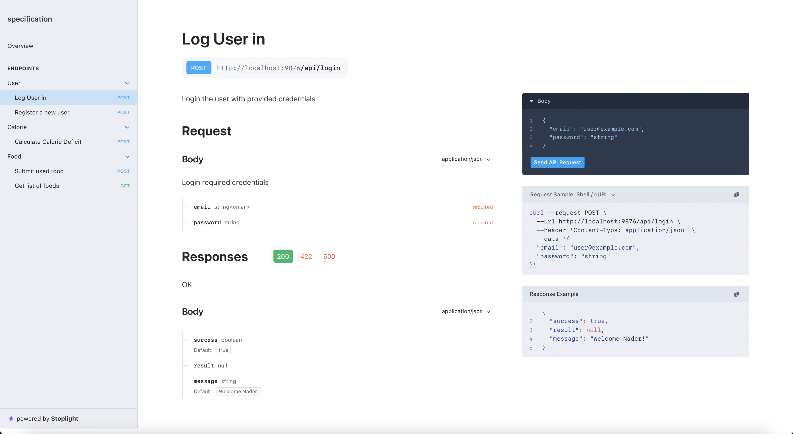
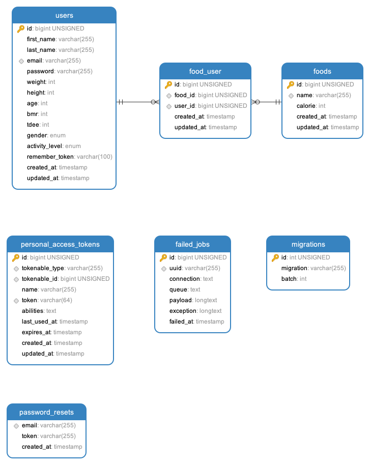

# Code Sample Project

This is a calorie calculator project that helps you calculate MBR, TDEE and also the amount of daily required calorie to
reach a certain weight in a certain period.

````
Disclaimer: the calculation in this source code is not exact and also not meant to be used in real life under any circumstances!
This is only created to show a sample code written by me in laravel.
````

## Requirements

The only requirement to run and test the project is to have `docker` engine and `docker compose` installed and running.

after cloning the project, go to the root of the project and run these commands:

1. create an environment variable file from the example file
    ``` shell
    mv .env.example .env
    ```
2. build the images
   ``` shell
   docker-compose build
   ```
3. run the container
   ``` shell
   docker-compose up
   ```
4. run the tests

   There is a command runner script that can be used to easily run commands inside the running container named `run`.
   ``` shell
   ./run php artisan test
   ```
5. you can also run the console command by
   ``` shell
   ./run php artisan migrate
   ```

## Project explanations

* Project is developed using TDD methodology
* PHP version 8.1 and Laravel version 9 has been used
* Mysql version 8 has been used for both testing and production
* Project API specification is created and accessible through [/specification](http://localhost:9876/specification)
  path.


## Project ERD


